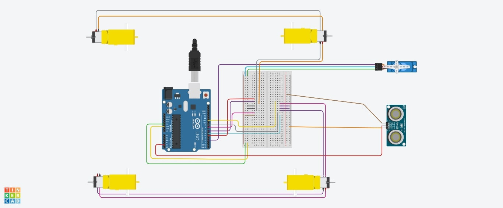

# Infrared Remote Controlled Car with Ultrasonic Sensor
Discover the remarkable adventure of my robot-controlled car, brought to life with an Arduino and a wide combination of components. From overcoming technical challenges to the construction of the robot, this project has been an insightful experience. 

| **Engineer** | **School** | **Area of Interest** | **Grade** |
|:--:|:--:|:--:|:--:|
| Viraj V | Dougherty Valley High School | Mechanical Engineering | Incoming Junior


  
<!--# Final Milestone
For your final milestone, explain the outcome of your project. Key details to include are:
- What you've accomplished since your previous milestone
- What your biggest challenges and triumphs were at BSE
- A summary of key topics you learned about
- What you hope to learn in the future after everything you've learned at BSE

**Don't forget to replace the text below with the embedding for your milestone video. Go to Youtube, click Share -> Embed, and copy and paste the code to replace what's below.**

<iframe width="560" height="315" src="https://www.youtube.com/embed/F7M7imOVGug" title="YouTube video player" frameborder="0" allow="accelerometer; autoplay; clipboard-write; encrypted-media; gyroscope; picture-in-picture; web-share" allowfullscreen></iframe>
-->
# Second Milestone
Since my previous milestone, I have worked on technical aspects of my project, including software and code integrated into the RC Car. I was able to upload code for the IR Remote to work with my car, and get it to move in the direction I want it to using the remote. I did this by having the car move in the direction I want it to by clicking the control once and letting it keep moving with no delay until I command it to either stop in place, or click a different control to move in a different direction. This way, I have the ease of not needing to constantly hold down the button and just let it continue to move in the direction I want it to until I click the "stop" command button or a different direction. A challenge I faced was the first code I found online didn't work like I wanted it to and just kept repeating the "stop" command repeatedly even when I didn't click any controls on the remote. I overcame this by editing some of the code and integrating some code from my previous upload of the IR Remote and got it to respond to the remote and get the motors running.

<iframe width="560" height="315" src="https://www.youtube.com/embed/vc1ye0t6fUM" title="YouTube video player" frameborder="0" allow="accelerometer; autoplay; clipboard-write; encrypted-media; gyroscope; picture-in-picture; web-share" allowfullscreen></iframe>

# First Milestone
My project is the RC Car and this is my first milestone. So far, I have completed piecing together the base of my project and have the overall hardware for the wires all plugged into the Arduino UNO. Some key components for this project include an ultrasonic sensor located in the front of the car for obstacle avoidance features, four motors for the tires to run, an Arduino UNO for plugging in all the components, a reciever; later used for the remote control, and a USB input to later integrate code into my project. A challenge I faced was not being able to plug in the camera; located on the top of the car, into the serial port on the arduino UNO because unfortunately with this chip I cannot plug both the camera, and the USB for uploading code, at the same time. My plan to complete this project is to get the motors up and running with the given IR (Infarred Remote) Control from the kit and get the ultrasonic sensors to work and avoid any objects in its path.  

<iframe width="560" height="315" src="https://www.youtube.com/embed/lkt41rrJCsg" title="YouTube video player" frameborder="0" allow="accelerometer; autoplay; clipboard-write; encrypted-media; gyroscope; picture-in-picture; web-share" allowfullscreen></iframe>

# Schematics 


# Code

```c++
#include <IRremote.h>
#include <SparkFun_TB6612.h>
#include <Servo.h>

Servo myservo;

int pos = 0;  

const int in1 = 5;
const int in2 = 6;
const int in3 = 9;
const int in4 = 10;

const int trigPin = 13;
const int echoPin = 12;


// float readSensorData() {
//   digitalWrite(trigPin, LOW);
//   delayMicroseconds(2);
//   digitalWrite(trigPin, HIGH);
//   delayMicroseconds(10);
//   digitalWrite(trigPin, LOW);
//   float distance = pulseIn(echoPin, HIGH) / 58.00; //Equivalent to (340m/s*1us)/2
//   return distance;
// }


////////// IR REMOTE CODES //////////
#define F 16736925	// FORWARD
#define B 16754775	// BACK
#define L 16720605	// LEFT
#define R 16761405	// RIGHT
#define S 16712445	// STOP
#define UNKNOWN_F 5316027		  // FORWARD
#define UNKNOWN_B 2747854299	// BACK
#define UNKNOWN_L 1386468383	// LEFT
#define UNKNOWN_R 553536955		// RIGHT
#define UNKNOWN_S 3622325019	// STOP
 
#define RECV_PIN  9
 
/*define channel enable output pins*/
#define ENA 5	  // Left  wheel speed
#define ENB 6	  // Right wheel speed
/*define logic control output pins*/
#define IN1 7	  // Left  wheel forward
#define IN2 8	  // Left  wheel reverse
#define IN3 9	  // Right wheel reverse
#define IN4 11	// Right wheel forward
#define carSpeed 150	// initial speed of car >=0 to <=255
 
IRrecv irrecv(RECV_PIN);
decode_results results;
unsigned long val;
unsigned long preMillis;

const int ledPin = 13;
int speed = 150;

#define AIN1 7
#define BIN1 8
#define AIN2 1
#define BIN2 2
#define PWMA 5
#define PWMB 6
#define STBY 3

const int offsetA = 1;
const int offsetB = 1;

Motor motor1 = Motor(AIN1, AIN2, PWMA, offsetA, STBY);
Motor motor2 = Motor(BIN1, BIN2, PWMB, offsetB, STBY);
 
/**
 * BEGIN DEFINE FUNCTIONS
 */
 
 void forward(){ 
  digitalWrite(ENA,HIGH);
  digitalWrite(ENB,HIGH);
  digitalWrite(IN1,HIGH);
  digitalWrite(IN2,LOW);
  digitalWrite(IN3,LOW);
  digitalWrite(IN4,HIGH);
  forward(motor1, motor2, 150);
  myservo.write(90);
  // delay(500);
  // brake(motor1, motor2);
  Serial.println("go forward!");
}
void back(){
  digitalWrite(ENA,HIGH);
  digitalWrite(ENB,HIGH);
  digitalWrite(IN1,LOW);
  digitalWrite(IN2,HIGH);
  digitalWrite(IN3,HIGH);
  digitalWrite(IN4,LOW);
  back(motor1, motor2, -150);
  myservo.write(90);
  Serial.println("go back!");
}
void left(){
  analogWrite(ENA,carSpeed);
  analogWrite(ENB,carSpeed);
  digitalWrite(IN1,LOW);
  digitalWrite(IN2,HIGH);
  digitalWrite(IN3,LOW);
  digitalWrite(IN4,HIGH); 
  right(motor1, motor2, 100);
  myservo.write(180);
  Serial.println("go left!");
}
void right(){
  analogWrite(ENA,carSpeed);
  analogWrite(ENB,carSpeed);
  digitalWrite(IN1,HIGH);
  digitalWrite(IN2,LOW);
  digitalWrite(IN3,HIGH);
  digitalWrite(IN4,LOW);
  left(motor1, motor2, 100);
  myservo.write(0);
  Serial.println("go right!");
}

void stop() {
  digitalWrite(ENA, LOW);
  digitalWrite(ENB, LOW);
  Serial.println("STOP!");
}
 
void setup() {
  Serial.begin(9600);
  pinMode(IN1,OUTPUT);
  pinMode(IN2,OUTPUT);
  pinMode(IN3,OUTPUT);
  pinMode(IN4,OUTPUT);
  pinMode(ENA,OUTPUT);
  pinMode(ENB,OUTPUT);
  stop();
  irrecv.enableIRIn();  

   //ultrasonic
  myservo.attach(10); 
  pinMode(echoPin, INPUT);
  pinMode(trigPin, OUTPUT);
}

 
void loop() {
  if (irrecv.decode(&results)){ 
    preMillis = millis();
    val = results.value;
    Serial.println(val);
    irrecv.resume();
    switch(val){
      case F: 
      case UNKNOWN_F: forward();
      // if (readSensorData() > 100){
      //   forward(); }
      // else {
      //   stop();
      // }
      break;
      case B: 
      case UNKNOWN_B: back(); break;
      case L: 
      case UNKNOWN_L: left(); break;
      case R: 
      case UNKNOWN_R: right();break;
      case S: 
      case UNKNOWN_S: stop(); break;
      default: break;


    }
  
  }
  delay(500);

//  float distance = readSensorData(); -------------------
//  Serial.println(distance); -----------------
  // else{
  //   if(millis() - preMillis > 500){
  //     stop();
  //     preMillis = millis();
  //   }
  // }
} 
```

# Bill of Materials

| **Part** | **Note** | **Price** | **Link** |
|:--:|:--:|:--:|:--:|
| Elegoo Smart Robot Car | Project Kit for RC Car | $79.99 | <a href="https://www.amazon.com/ELEGOO-Tracking-Ultrasonic-Intelligent-Educational/dp/B07KPZ8RSZ"> Amazon Link </a>

# Outside Resources
- [Example Code For IR Remote](https://dronebotworkshop.com/elegoo-smart-robot-car-part-2/#Infrared_Remote_Car_Control)
- [SunFounder Ultrasonic Module](https://docs.sunfounder.com/projects/3in1-kit/en/latest/car_project/car_ultrasonic.html)
- [Sparkfun Motor Test Run/Library](https://learn.sparkfun.com/tutorials/sik-experiment-guide-for-the-arduino-101genuino-101-board/experiment-12-using-the-motor-driver)
